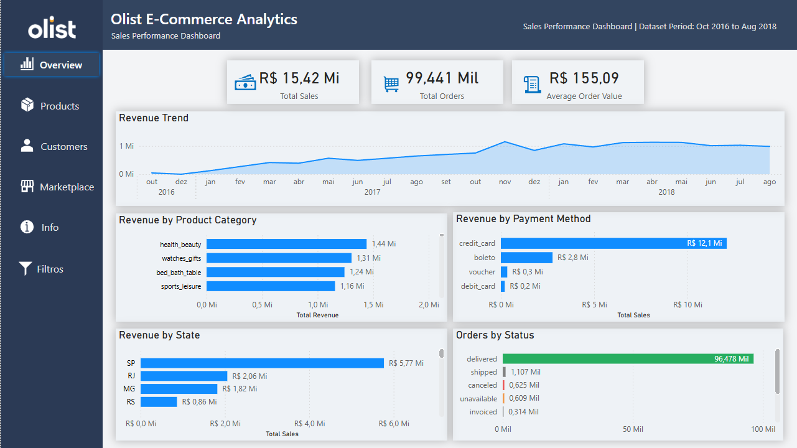
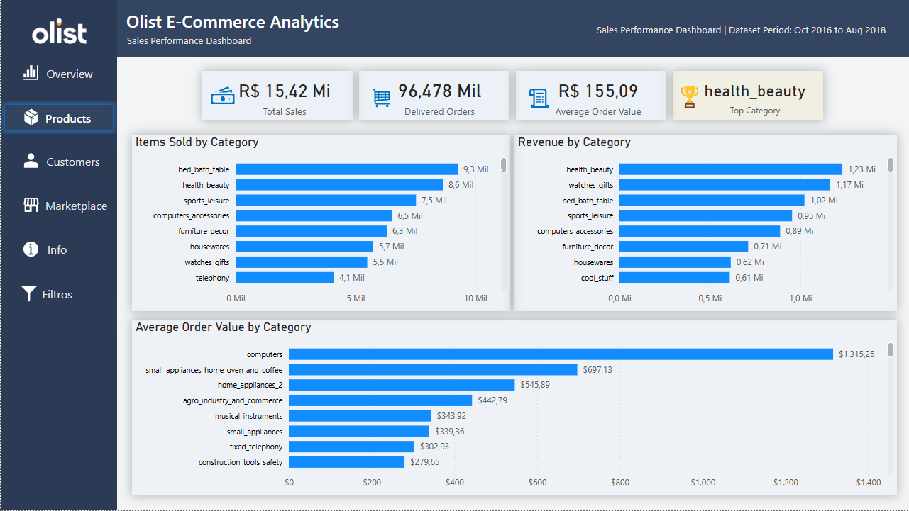
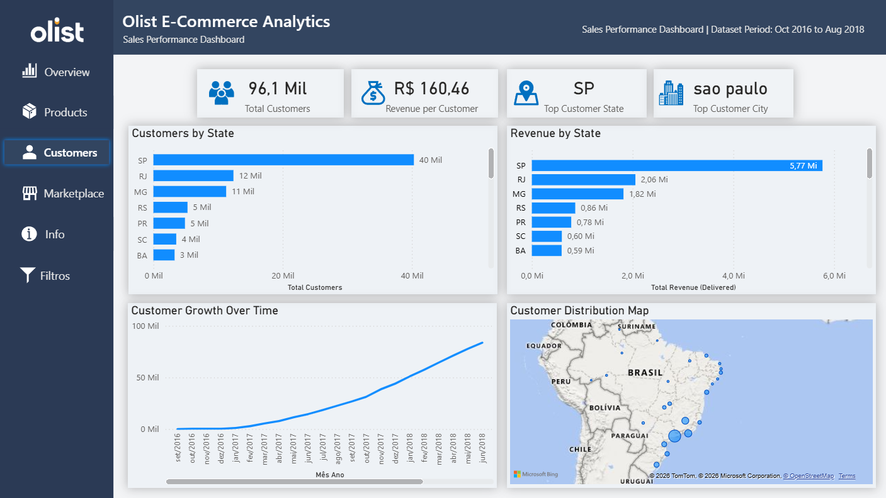
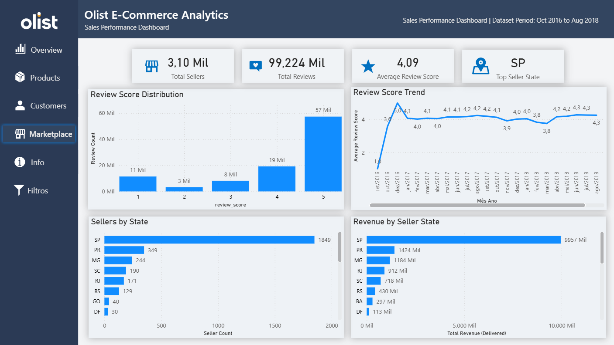
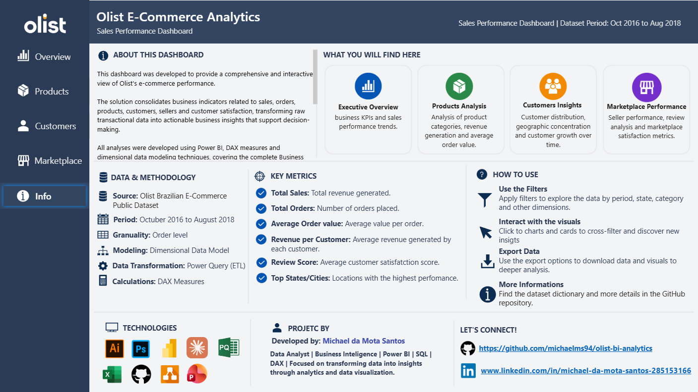
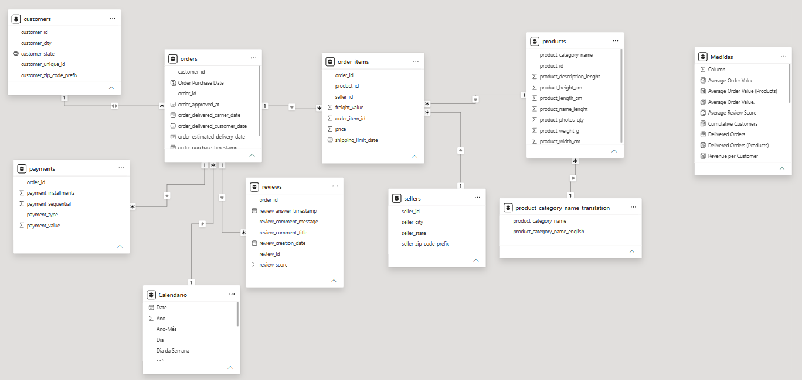
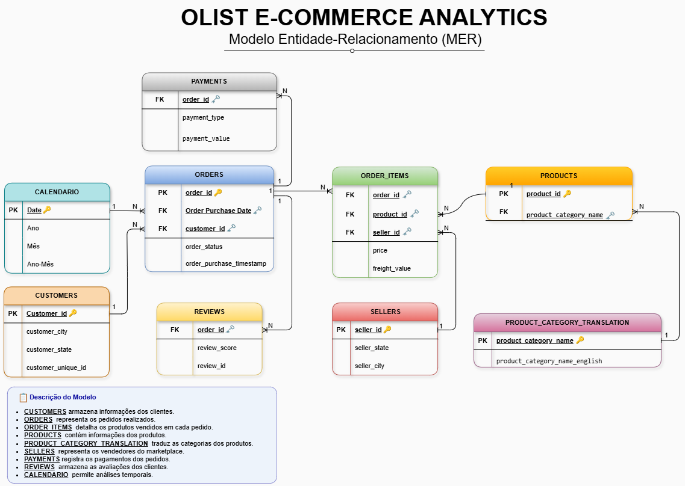

# 📊 Olist E-Commerce Analytics

<p align="center">
  
  
  
  
</p>

<p align="center">
Dashboard de Business Intelligence desenvolvido em Power BI utilizando o dataset público da Olist.
</p>

---

# 🚀 Sobre o Projeto

O **Olist E-Commerce Analytics** é um projeto de Business Intelligence desenvolvido como trabalho final da graduação em **Análise e Desenvolvimento de Sistemas**.

O objetivo foi transformar dados transacionais de e-commerce em informações estratégicas por meio de modelagem de dados, medidas DAX, visualizações interativas e análise orientada ao negócio.

Durante o projeto foram aplicados conceitos de:

* Business Intelligence
* Data Analytics
* Modelagem de Dados
* Modelagem Dimensional
* DAX
* Power Query
* Data Visualization
* Analytics Storytelling
* Git e GitHub

Embora tenha sido desenvolvido inicialmente como projeto acadêmico, a proposta foi construir uma solução próxima de um cenário corporativo, contemplando documentação técnica, modelagem de dados, KPIs e dashboards executivos.

---

# 🎯 Objetivo de Negócio

O projeto foi desenvolvido para responder perguntas estratégicas como:

* Qual o faturamento total da operação?
* Quantos pedidos foram realizados?
* Quais categorias geram mais receita?
* Quais estados concentram clientes e vendas?
* Como a base de clientes evoluiu ao longo do tempo?
* Quais regiões possuem mais vendedores?
* Como está a satisfação dos clientes?
* Como as avaliações se comportam ao longo do período analisado?

---

# 📦 Dataset Utilizado

### Olist Brazilian E-Commerce Public Dataset

Período analisado:

```text
Outubro de 2016 até Agosto de 2018
```

O dataset contém informações sobre:

* Pedidos
* Clientes
* Produtos
* Categorias
* Pagamentos
* Vendedores
* Avaliações
* Geolocalização

---

# 🛠️ Tecnologias Utilizadas

| Tecnologia  | Finalidade                               |
| ----------- | ---------------------------------------- |
| Power BI    | Desenvolvimento dos dashboards           |
| DAX         | Criação de medidas e KPIs                |
| Power Query | ETL e preparação dos dados               |
| Draw.io     | Construção do MER                        |
| Git         | Controle de versão                       |
| GitHub      | Hospedagem e documentação                |
| Excel       | Validação e exploração inicial dos dados |

---

# 💡 Diferencial do Projeto

Todo o dashboard foi desenvolvido em inglês de forma intencional.

A decisão teve como objetivo praticar terminologias amplamente utilizadas em ambientes corporativos de:

* Business Intelligence
* Analytics
* Data Visualization
* Data Modeling

Ao mesmo tempo, a documentação do projeto foi mantida em português para facilitar a compreensão do contexto de negócio.

---

# 🏗️ Arquitetura do Projeto

```text
olist-bi-analytics

├── data/
├── docs/
├── icons/
├── images/
├── powerbi/
│
├── README.md
└── LICENSE
```

---

# 📈 Dashboard Preview

## 📊 Overview

 

### KPIs

* 💰 Total Sales
* 🛒 Total Orders
* 💵 Average Order Value

### Análises

* Revenue Trend
* Revenue by Product Category
* Revenue by Payment Method
* Revenue by State
* Orders by Status

### Principais Insights

✅ São Paulo lidera o faturamento nacional.

✅ Cartão de crédito é o principal método de pagamento.

✅ A maior parte dos pedidos foi entregue com sucesso.

✅ Poucas categorias concentram parcela significativa da receita.

---

## 📦 Products



### KPIs

* 💰 Total Sales
* 📦 Delivered Orders
* 💵 Average Order Value
* 🏆 Top Category

### Análises

* Items Sold by Category
* Revenue by Category
* Average Order Value by Category

### Principais Insights

✅ Health Beauty apresenta o maior faturamento.

✅ Bed Bath Table lidera em volume de vendas.

✅ Categorias com maior volume nem sempre possuem maior receita.

✅ Algumas categorias possuem ticket médio significativamente superior à média geral.

---

## 👥 Customers



### KPIs

* 👥 Total Customers
* 💰 Revenue per Customer
* 🌎 Top Customer State
* 🏙️ Top Customer City

### Análises

* Customers by State
* Revenue by State
* Customer Growth Over Time
* Customer Distribution Map

### Principais Insights

✅ São Paulo concentra a maior base de clientes.

✅ São Paulo também lidera em receita.

✅ A base de clientes apresentou crescimento consistente ao longo do período.

✅ A região Sudeste concentra a maior parte dos consumidores.

---

## 🏪 Marketplace



### KPIs

* 🏪 Total Sellers
* ⭐ Total Reviews
* ⭐ Average Review Score
* 📍 Top Seller State

### Análises

* Sellers by State
* Revenue by Seller State
* Review Score Distribution
* Review Score Trend

### Principais Insights

✅ Mais de 3 mil vendedores cadastrados.

✅ Mais de 99 mil avaliações registradas.

✅ Nota média superior a 4 estrelas.

✅ A maioria das avaliações recebeu nota máxima.

✅ São Paulo lidera em quantidade de vendedores e faturamento.

---

## 📘 Info



Página criada para documentar o projeto e facilitar a navegação do usuário.

Contém:

* Objetivo do dashboard
* Metodologia
* Tecnologias utilizadas
* KPIs principais
* Instruções de uso
* Informações do projeto

---

# 🔗 Modelo de Dados

## Power BI Data Model



A modelagem foi construída utilizando conceitos de modelagem dimensional para permitir análises integradas entre:

* Clientes
* Pedidos
* Produtos
* Categorias
* Vendedores
* Pagamentos
* Avaliações
* Calendário

---

# 🏗️ Modelo Entidade-Relacionamento (MER)



O MER foi desenvolvido para documentar a estrutura de dados utilizada no projeto.

### Principais Relacionamentos

🔑 Customers → Orders

* Um cliente pode realizar diversos pedidos.

🔑 Orders → Order Items

* Um pedido pode conter diversos produtos.

🔑 Orders → Payments

* Um pedido pode possuir um ou mais registros de pagamento.

🔑 Orders → Reviews

* Um pedido pode gerar avaliações dos clientes.

🔑 Products → Order Items

* Um produto pode aparecer em diversos pedidos.

🔑 Sellers → Order Items

* Um vendedor pode comercializar diversos produtos.

🔑 Calendar → Orders

* Permite análises temporais e séries históricas.

---

# 📊 Principais Medidas DAX

## Total Orders

```DAX
Total Orders =
DISTINCTCOUNT(orders[order_id])
```

## Total Revenue

```DAX
Total Revenue =
CALCULATE(
    SUMX(
        order_items,
        order_items[price] +
        order_items[freight_value]
    ),
    orders[order_status] = "delivered"
)
```

## Average Order Value

```DAX
Average Order Value =
DIVIDE(
    [Total Revenue],
    [Total Orders]
)
```

## Total Customers

```DAX
Total Customers =
DISTINCTCOUNT(
    customers[customer_unique_id]
)
```

## Revenue per Customer

```DAX
Revenue per Customer =
DIVIDE(
    [Total Revenue],
    [Total Customers]
)
```

## Total Sellers

```DAX
Total Sellers =
DISTINCTCOUNT(
    sellers[seller_id]
)
```

## Average Review Score

```DAX
Average Review Score =
AVERAGE(
    reviews[review_score]
)
```

---

# 🧠 Perguntas de Negócio Respondidas

Este dashboard permite responder perguntas como:

* Quanto o marketplace faturou?
* Quantos pedidos foram realizados?
* Quais categorias geram mais receita?
* Onde estão os principais clientes?
* Quais estados geram mais faturamento?
* Como a base de clientes evoluiu?
* Onde estão concentrados os vendedores?
* Como os clientes avaliam suas experiências?
* O nível de satisfação mudou ao longo do tempo?

---

# 📌 Principais Aprendizados

Durante o desenvolvimento deste projeto foram consolidados conhecimentos em:

✅ Business Intelligence

✅ Data Analytics

✅ Data Visualization

✅ DAX

✅ Power Query

✅ Modelagem Dimensional

✅ Storytelling com Dados

✅ Git e GitHub

✅ Documentação Técnica

---

# 🚀 Próximos Passos

Este projeto foi desenvolvido inicialmente como atividade acadêmica, utilizando as tecnologias abordadas durante a graduação.

Entretanto, ele não será encerrado após a entrega da disciplina.

O objetivo é utilizar o mesmo dataset como ambiente contínuo de aprendizado e evolução técnica.

### Fase 2 — SQL Analytics

Planejamento:

* Consultas analíticas
* CTEs
* Window Functions
* Ranking de categorias
* Análises de retenção
* Data Mart analítico

### Fase 3 — Python Analytics

Planejamento:

* Pandas
* NumPy
* Matplotlib
* Seaborn
* Jupyter Notebook

Análises previstas:

* Segmentação de clientes
* RFM Analysis
* Forecast de vendas
* Market Basket Analysis
* Análises comportamentais

### Fase 4 — Engenharia de Dados

Planejamento:

* ETL em Python
* Banco de Dados SQL
* Data Warehouse
* Automatização de cargas
* Pipeline de dados

💡 A ideia é manter este repositório vivo, adicionando novas tecnologias, análises e boas práticas à medida que avanço na minha jornada profissional na área de Dados.

---

# 👨‍💻 Autor

## Michael da Mota Santos

📊 Data Analytics

📈 Business Intelligence

⚙️ Power BI • DAX • Power Query • GitHub

### LinkedIn

https://www.linkedin.com/in/michael-da-mota-santos-285153166

### GitHub

https://github.com/michaelms94

---

# ⭐ Considerações Finais

Mais do que um trabalho acadêmico, este projeto representa minha evolução na área de Dados e Business Intelligence.

Ele reúne conceitos de modelagem, análise, visualização, documentação e versionamento, simulando um fluxo próximo ao encontrado em projetos corporativos.

O objetivo agora é continuar expandindo a solução, incorporando SQL, Python, Engenharia de Dados e novas análises para transformar este repositório em um portfólio completo de Data Analytics e Business Intelligence.
